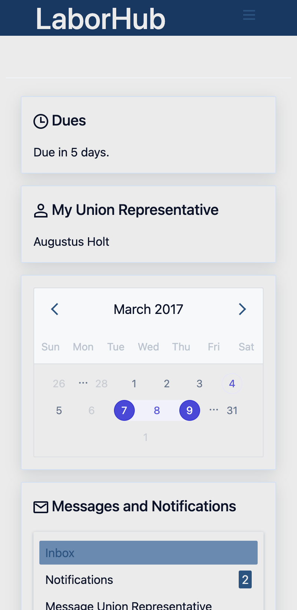
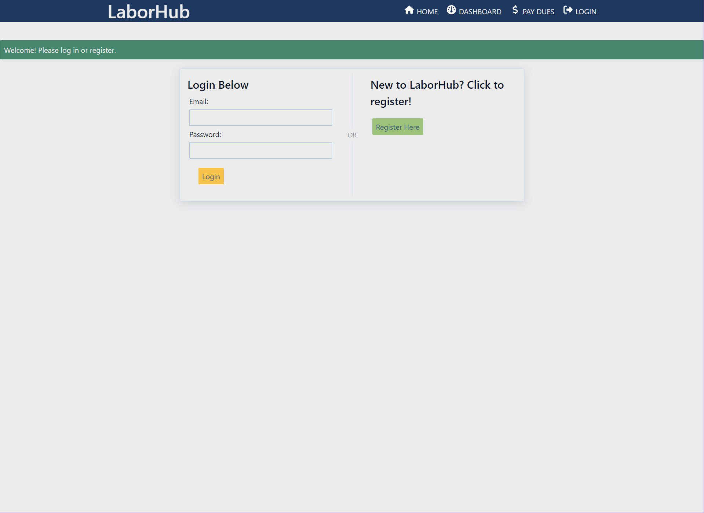
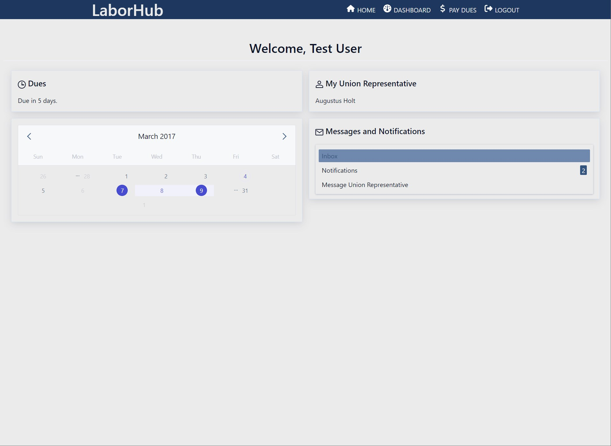

# LaborHub

## Description

LaborHub is a member management system for local unions. It allows members to check the due date for union dues, see organizational demographics, and contact their union representative. It can also be used by employees who wish to discreetly share and compare salaries and demographics.

This app uses the following technologies:

**Node.js** and **Express.js** for creating a RESTful API.

**Handlebars.js** for keeping the HTML simple and dynamic.

**MySQL** and **Sequelize** for interacting with and updating the database.

**PayPal** npm package for payment processing.

## Table of Contents
- [Links](#links)
- [Documentation](#documentation)
- [Collaborators](#collaborators)
- [Preview](#preview)
- [License](#license)
- [Node Dependencies](#node-dependencies)
- [Badges](#badges)

## Links

[Deployed Site](https://laborhub.herokuapp.com/)

[GitHub Repository](https://github.com/jsnicholas/LaborHub)

## Documentation

View the repository's wiki page for information on how to navigate the site  
[Wiki-Page](https://github.com/jsnicholas/LaborHub/wiki)

## Collaborators

**Tina Croxton**  
*Database Administrator*  
[GitHub Profile](https://github.com/TinaTheDev91)

**Victoria McNorrill**  
*Front-End Developer*  
[Github Profile](https://github.com/victoriamcn)

**John Kersey**  
*Router*  
[Github Profile](https://github.com/JohnKersey2)

**Nick Johnson**  
*Project Manager / Debug Support*  
[Github Profile](https://github.com/jsnicholas)

## Preview

## License

[MIT](https://img.shields.io/badge/License-MIT-blue.svg)
This project is licensed under MIT.
- [Click](https://pitt.libguides.com/openlicensing/MIT#:~:text=Users%20of%20software%20using%20an,and%20the%20X%20Windows%20System.) here to view the license documentation or,
- Go to the [license file](https://github.com/jsnicholas/LaborHub/blob/main/LICENSE) with in this repository.

## Node Dependencies

Click links to read the documentation for each dependency:
- [bcrypt](https://www.npmjs.com/package/bcrypt)
- [connect-session](https://www.npmjs.com/package/express-session)
- [connect-session-sequelize](https://www.npmjs.com/package/connect-session-sequelize)
- [dotenv](https://www.npmjs.com/package/dotenv) 
- [express](https://www.npmjs.com/package/express)
- [express-handlebars](https://www.npmjs.com/package/express-handlebars)
- [express-session](https://www.npmjs.com/package/express-session#secret)
- [handlebars.js](https://www.npmjs.com/package/handlebars)
- [MySQL2](https://www.npmjs.com/package/mysql2)
- [PayPal REST SDK](https://www.npmjs.com/package/paypal-rest-sdk)
- [Sequelize](https://www.npmjs.com/package/sequelize)
- [Spectre.css](https://picturepan2.github.io/spectre/index.html)

## Badges

### Cloud

### Database

### Frameworks and Libraries

### Integrated Development Environments (IDE)

### Languages

### ORM
